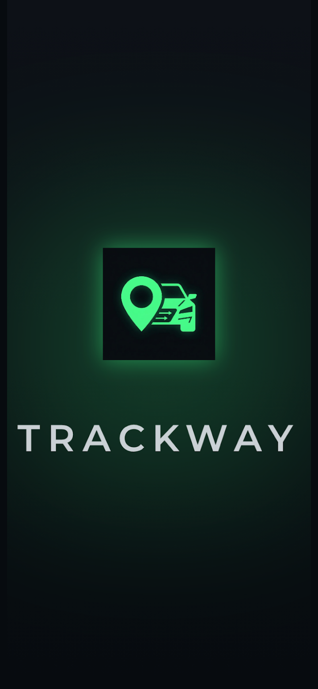
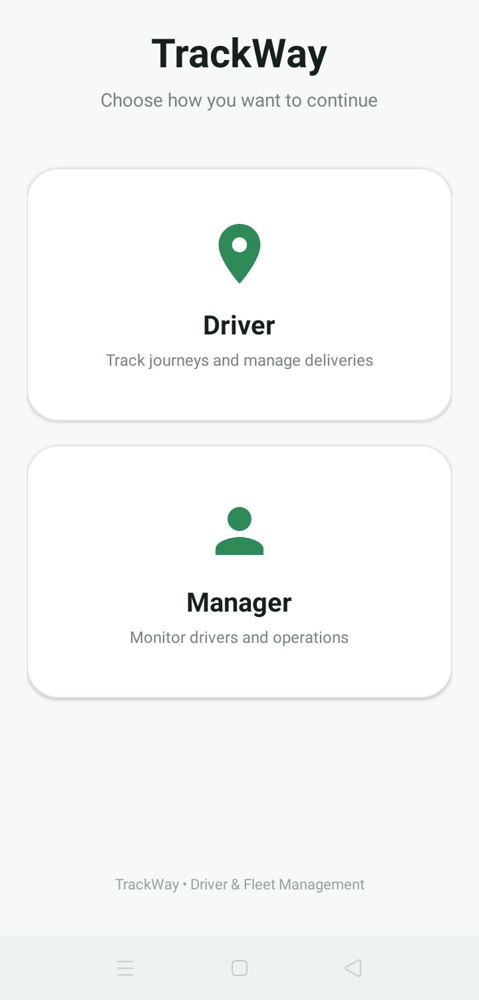
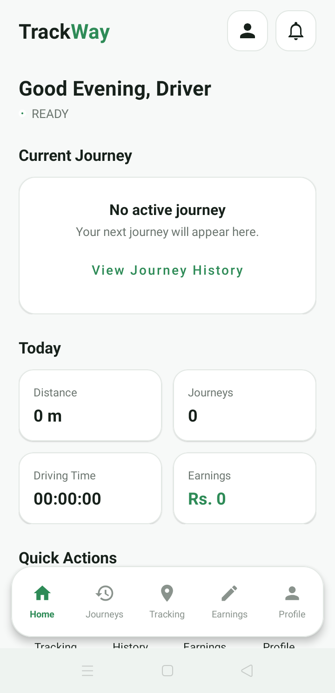
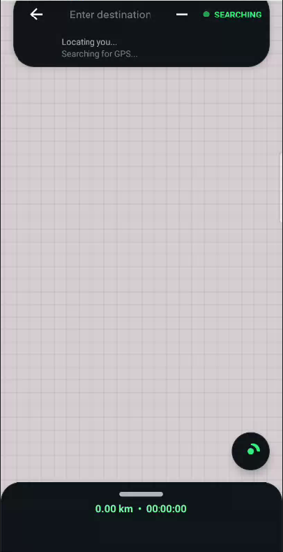
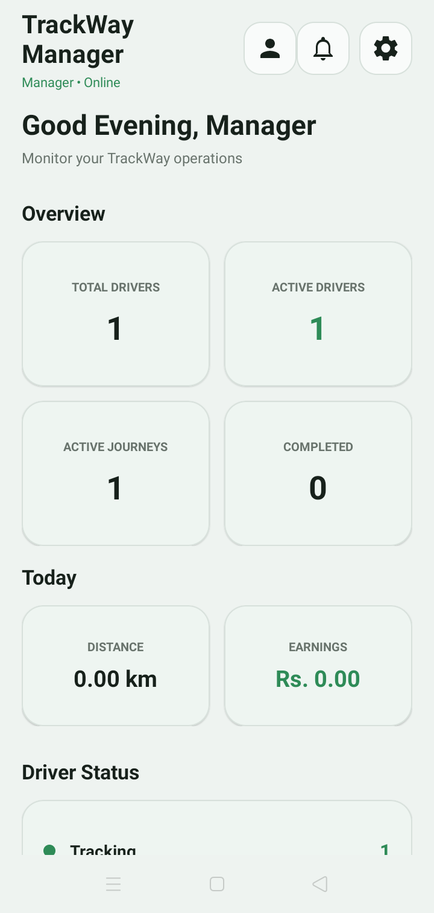
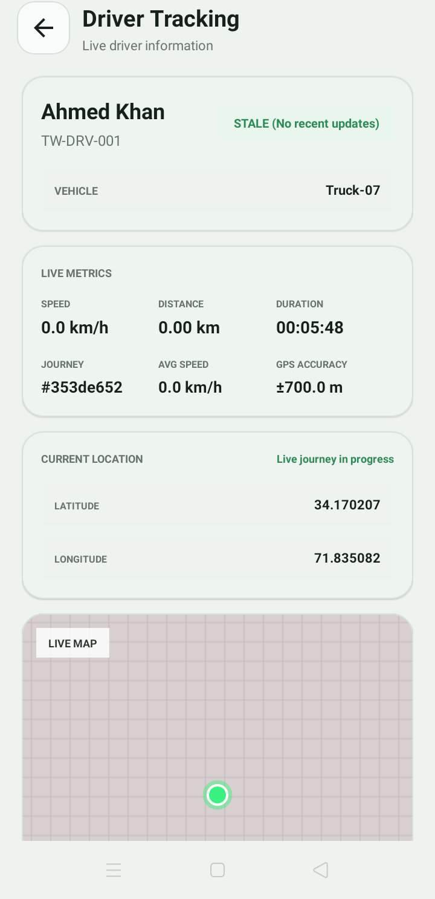
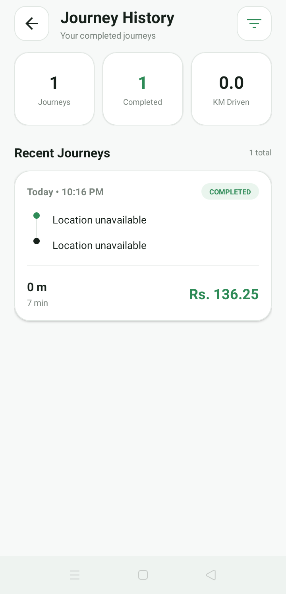

# 🛰️ TrackWay

### Real-Time GPS Vehicle & Delivery Tracking System

> A professional Android-based vehicle and delivery tracking platform built with Java, XML, GPS, and Node.js. TrackWay connects drivers and managers through live location tracking, delivery monitoring, activity notifications, and journey history.


---

# 📖 About TrackWay

TrackWay is a professional **GPS vehicle and delivery tracking system** designed around two primary experiences:

- 🚚 **Driver Experience** — Start and manage live tracking sessions, monitor GPS status, deliveries, and journey information.
- 🧭 **Manager Experience** — Monitor active drivers, vehicle locations, deliveries, activities, notifications, and completed journeys.

When a driver starts a journey, TrackWay activates GPS tracking and synchronizes location information with the Node.js backend, allowing managers to monitor the driver's current status and location.

The application combines **real-time GPS tracking, delivery monitoring, journey statistics, activity history, notifications, and role-based workflows** into one centralized platform.

---

# ✨ Features

## 🛰️ Real-Time GPS Tracking

- Live vehicle location tracking
- GPS accuracy and status
- Continuous location updates
- Journey start/end tracking
- Distance and duration monitoring
- Interactive tracking map
- Current location and recenter controls

## 🚚 Driver Experience

- Driver dashboard
- Start/stop tracking
- Active journey monitoring
- GPS status
- Delivery information
- Journey statistics
- Tracking history
- Notifications
- Driver profile and settings

## 🧭 Manager Experience

- Manager dashboard
- Active driver monitoring
- Driver status
- Live vehicle locations
- Driver details
- Delivery monitoring
- Activity history
- Journey history
- Manager notifications

## 📦 Delivery Tracking

- Delivery identification
- Assigned driver and vehicle
- Destination information
- Delivery status
- Journey information
- Delivery start/completion tracking

## 🔔 Activity Notifications

TrackWay keeps managers informed about important events such as:

- Tracking started
- Tracking stopped
- Delivery started
- Delivery completed
- Driver offline
- Tracking interruption
- Journey completed

## 📊 Journey Statistics

- Distance travelled
- Journey duration
- Start/end time
- Current and average speed
- GPS accuracy
- Location update information

## 📜 Activity & Journey History

Managers can review previous driver activities and completed journeys through organized history screens.

## 🔐 Role-Based Experience

TrackWay provides dedicated workflows for **Drivers** and **Managers**, allowing each role to access the features relevant to their responsibilities.

---

# 🎨 Premium User Interface

TrackWay follows a professional modern Android design focused on clarity and real-time information.

### 🎨 Visual Design

- 🌑 Professional dark interface
- 🛰️ GPS tracking indicators
- 📍 Location-focused visual elements
- 📦 Rounded information cards
- 📊 Real-time statistics
- 🟢 Driver status indicators
- 🗺️ Interactive map experience
- 🎛️ Clean tracking controls
- 📱 Responsive Android layouts
- ✨ Consistent Material Design components

The interface is designed to make important tracking information immediately visible while keeping Driver and Manager workflows simple and intuitive.

---

# 📸 Application Preview

The screenshots below showcase the main Driver and Manager experiences of TrackWay.

> Place your screenshots inside the `screenshots/` folder using the filenames shown below.

---

## 🌟 Splash Screen

<p align="center">
  
</p>

---

## 👥 Role Selection

<p align="center">
  
</p>

---

## 🚚 Driver Dashboard

<p align="center">
  
</p>

---

## 🛰️ Driver Tracking

<p align="center">
  
</p>

---

## 🧭 Manager Dashboard

<p align="center">
  
</p>

---

## 🗺️ Manager Live Tracking

<p align="center">
  
</p>

---

## 📊 Journey & Activity History

<p align="center">
  
</p>

---

# 🛠 Technology Stack

## 📱 Android Development

- Java
- XML
- Android Studio
- Android SDK
- AndroidX
- Material Design
- ConstraintLayout
- RecyclerView
- ViewBinding
- Runtime Permissions

## 📍 GPS & Location

- GPS
- Android Location Services
- Continuous Location Updates
- Location Accuracy Monitoring
- Interactive Maps
- Vehicle Location Markers

## 🌐 Backend & Networking

- Node.js
- REST API
- JSON
- HTTP Communication
- Client-server synchronization

## 🔔 Android Services

- Notifications
- Location Services
- Runtime Permissions
- Background tracking support

## 🧰 Development Tools

- Git
- GitHub
- Gradle
- Android Studio
- Java Development Kit

---

# 🏗 Architecture

TrackWay follows a **role-based client-server architecture** where Driver and Manager experiences communicate through a centralized Node.js backend.

```text
                    🛰️ TRACKWAY

             ┌───────────────┐
             │ 🚚 DRIVER     │
             └───────┬───────┘
                     │
                     ▼
              📍 Android GPS
                     │
                     ▼
             🌐 Node.js Backend
                     │
              ┌──────┴──────┐
              │             │
              ▼             ▼
       📊 Tracking Data   🔔 Activity Data
              │             │
              └──────┬──────┘
                     ▼
             ┌───────────────┐
             │ 🧭 MANAGER    │
             └───────┬───────┘
                     │
                     ▼
                🗺️ Live Map
